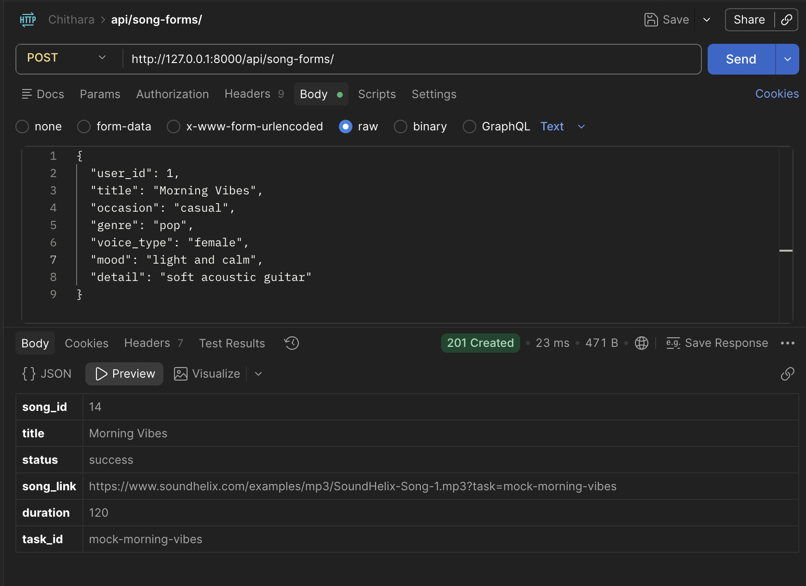
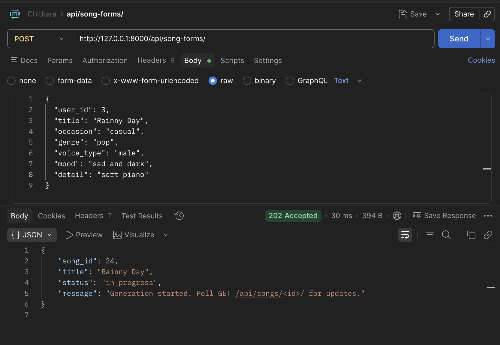

# Chithara

Chithara is a Django-based web application containing several interconnected modules including `user`, `listener`, `creator`, `song`, `song_form`, and `library`.

## Project Setup

Follow these instructions to set up the project on your local machine.

### Prerequisites

- Python 3.8+
- `pip` package manager

### Installation Steps

1. **Clone the repository:**
   ```bash
   git clone https://github.com/peerawattae/Chithara.git
   cd Chithara
   ```

2. **Create a virtual environment:**
   Using a virtual environment is highly recommended to keep project dependencies isolated.
   ```bash
   python3 -m venv venv
   ```

3. **Activate the virtual environment:**
   - **macOS/Linux:**
     ```bash
     source venv/bin/activate
     ```
   - **Windows:**
     ```cmd
     .\venv\Scripts\activate
     ```

4. **Install dependencies:**
   Install the required packages using the `requirements.txt` file:
   ```bash
   pip install -r requirements.txt
   ```

5. **Apply database migrations:**
   Set up your local SQLite database with all the necessary tables for the applications (`creator`, `library`, `listener`, `song`, `user`, etc.):
   ```bash
   python manage.py migrate
   ```

6. **Create a superuser (optional):**
   If you want to access the Django admin interface:
   ```bash
   python manage.py createsuperuser
   ```

7. **Run the development server:**
   ```bash
   python manage.py runserver
   ```
   The application should now be running. You can view it in your browser at `http://127.0.0.1:8000/`.

---
### Overview

Song generation uses the **Strategy Pattern** to allow swapping between a Mock strategy (offline, no API key needed) and the Suno API strategy (real AI generation) without changing any other code.

```
SongGeneratorStrategy  (abstract base class)
├── MockSongGeneratorStrategy   → instant, deterministic, no network
└── SunoSongGeneratorStrategy   → calls api.sunoapi.org, polls for result
```

The active strategy is selected via the `GENERATOR_STRATEGY` environment variable, read in `music_ai/settings.py`. Strategy selection is centralized in `core/generation/factory.py` — no if/else logic is scattered elsewhere.

---

### Setting up the Suno API Key

1. Sign up at [sunoapi.org](https://sunoapi.org) and get your API key from the dashboard.

2. Create a `.env` file in the project root (never commit this file):
   ```
   SUNO_API_KEY=your_actual_key_here
   GENERATOR_STRATEGY=suno
   ```

3. `.env` is already listed in `.gitignore` — your key will not be committed.

---

### How to run in Mock mode (default)

No API key required. Returns a placeholder audio URL instantly.

```bash
# Option A — set in .env
GENERATOR_STRATEGY=mock

# Option B — inline
GENERATOR_STRATEGY=mock python manage.py runserver
```

Test with Postman or curl:
```bash
curl -X POST http://127.0.0.1:8000/api/song-forms/ \
  -H "Content-Type: application/json" \
  -d '{
    "user_id": 1,
    "title": "Morning Vibes",
    "occasion": "casual",
    "genre": "pop",
    "voice_type": "female",
    "mood": "light and calm",
    "detail": "soft acoustic guitar"
  }'
```

Expected response (instant):
```json
{
  "song_id": 1,
  "title": "Morning Vibes",
  "status": "success",
  "song_link": "https://www.soundhelix.com/examples/mp3/SoundHelix-Song-1.mp3",
  "duration": 120,
  "task_id": "mock-morning-vibes"
}
```
Demonstration


---

### How to run in Suno mode

Requires a valid `SUNO_API_KEY`. Generation runs in a **background thread** — the API returns `202 Accepted` immediately so the user is never blocked.

```bash
# Option A — set in .env
GENERATOR_STRATEGY=suno
SUNO_API_KEY=your_key_here

# Option B — inline
GENERATOR_STRATEGY=suno SUNO_API_KEY=your_key python manage.py runserver
```

**Step 1 — Submit the generation request:**
```bash
curl -X POST http://127.0.0.1:8000/api/song-forms/ \
  -H "Content-Type: application/json" \
  -d '{
    "user_id": 1,
    "title": "Morning Vibes",
    "occasion": "casual",
    "genre": "pop",
    "voice_type": "male",
    "mood": "light and calm",
    "detail": "soft acoustic guitar"
  }'
```

The server responds **instantly** with `HTTP 202`:
```json
{
  "song_id": 2,
  "title": "Morning Vibes",
  "status": "in_progress",
  "message": "Generation started. Poll GET /api/songs/<id>/ for updates."
}
```

**Step 2 — Poll for the result:**
```bash
curl http://127.0.0.1:8000/api/songs/2/
```

Keep polling every 15–30 seconds. You will see the status progress through:
- `in_progress` — Suno is still generating
- `success` — song is ready, `song_link` and `cover_image` are populated
- `failed` — generation failed (quota, API error, etc.)

Expected success response (after ~2–3 minutes):
```json
{
  "id": 2,
  "title": "Morning Vibes",
  "status": "success",
  "song_link": "https://tempfile.aiquickdraw.com/r/....mp3",
  "cover_image": "https://musicfile.removeai.ai/....jpeg",
  "duration": 211,
  "created_by": "Peerawat",
  "create_at": "2026-04-23 15:49:38+00:00",
  "library_id": 1
}
```
Demonstration



---

### Strategy file locations

| File | Purpose |
|---|---|
| `core/generation/base.py` | Abstract interface + `GenerationRequest` / `GenerationResult` dataclasses |
| `core/generation/mock.py` | Mock strategy — offline, deterministic |
| `core/generation/suno.py` | Suno strategy — calls `api.sunoapi.org` |
| `core/generation/factory.py` | `get_generator()` — single centralized strategy selector |
| `music_ai/settings.py` | `GENERATOR_STRATEGY` setting (reads from env var) |